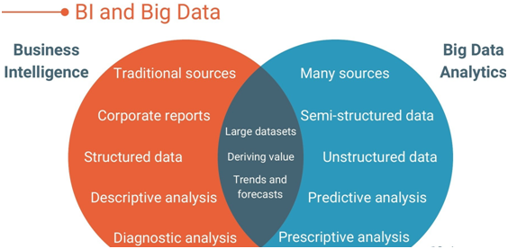
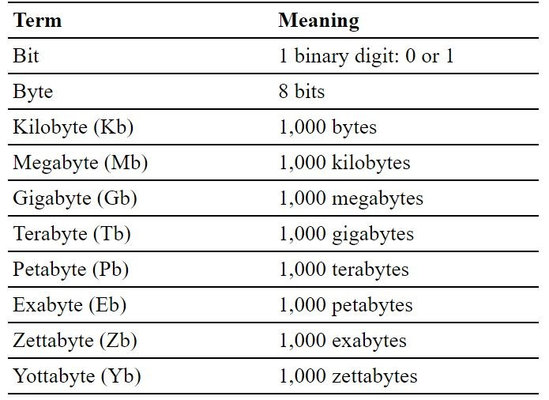

# Introduction
### It is evident that the amount of data being generated and recorded is increasing exponentially, because people are recording and generating data from everywhere, In addition to social networking sites, sensor devices, health records, health genome sequencing. Data from a variety of digital devices is formed from a variety of sources at high volumes and speeds resulting in the concept of Big Data. With the rapid growth of big data, handling, managing and analysing this data becomes difficult utilizing existing traditional systems. However, the big data is quite different from the data that is stored in the data warehouses. As opposed to the former, which is cleaned, managed, known, and trusted, the latter includes the information collected from all different warehouses, as well as information that these warehouses are unable to store. A single machine can't process or even hold all of the data we should analyse because of the big data problem. A large cluster is an instance of this type of computing, such as one of Google's data centres, which contains tens of thousands of computers.

# 1. Business Intelligence and Big Data
### In order to provide scientists, executives, managers and other business users with actionable information to help them make more informed business decisions, business intelligence (BI) is a technology-based process for analysing data. The term "BI" encompasses a collection of tools, apps, and methodologies that assists companies in gathering data from internal and external sources, preparing it for analysis, executing queries so that the data can produce valuable information, and generating reports and charts for data visualization so that the results generated will assist organizations in making accurate and timely decisions. [1]

# 2.Issues of Big data
## 2.1. Management issue
### Data provided by unstructured sources offers the potential to build a comprehensive understanding of your customers in addition to providing context for why sales are declining or costs are rising. Due to the nature of managing unstructured data at high speeds and volumes, you may collect a lot of valuable information, but you may also generate a lot of noise that obscures the insights that add the most value to your organization.[3]
### Several methods of managing large datasets are available as part of business intelligence, for example quantum computing and in-memory database management systems provide a cost-effective and quick method of managing large data sets. Nonetheless, since the existing businesses are established on traditional platforms, moving them to the new platform can be very time-consuming and costly.[2]
## 2.2. Storage issue
### Previously, it was sufficient to just purchase additional storage or disks. However, two developments are taking place at the same time. In the first place, the capital cost of purchasing additional capacity is not declining. The benefits of that capability and the processes that support it continue to grow. Data storage is a highly complex issue requiring a range of expertise. This is an issue associated with operational response. Second, there is an opportunity to actually utilize this data to drive value for the organization. There are many ways to capitalize on the value, such as being more efficient and responsive, or generating new revenue streams, or understanding customers better so products and services can be tailored more effectively and more quickly.[4]
## 2.3. Processing issue
### The volume of data being generated by most organizations is gradually increasing. Within a few years, existing capacity becomes insufficient, and companies are forced to take decisive actions in order to optimize performance and guarantee the resilience of an expanded system. One of the most significant challenges is the acquisition of new hardware, which is typically based on the cloud for storing and processing large volumes of data. Currently, most of the organizations operate online instead of in the brick-and-mortar mode of business in an effort to grab more customers, thereby boosting sales globally. This creates a storm of data in which the business operates. Simple solutions such as these are not always the most cost-effective solution. The results will be of little use if they are not generated accurately and timely. We are unable to process such vast quantities of data in real time with current infrastructure, machinery, and techniques. As a result, business organizations are handicapped. Though there are some advanced indexing schemes and data processing methods like map reduce that can speed up the processing speed, it is still difficult to process Zettabytes (1021) or even Exabytes (1018) of data. [5] The following figure shows data scale.

| Issue | Possible solutions | Limitations |
| --- | --- | --- |
| Management | An in-memory database management system based on quantum computing | It can be very expensive and time-consuming to move the entire business to a new system. |
| Storage | NoSQL, DFS and Cloud Computing | Storage of one exabyte requires 25000 no. of disk space, which is complex and time-consuming, and uploading to the cloud is a challenge|
| Processing | Scalable streaming systems (S4) and advanced indexing schemas. | Processors are still proving to be slow when it comes to handling Zettabytes (1021) and even Exabytes (1018) of data |

# 3. Challenges of Big Data
## 3.1. Lack of Bigdata Professionals
### Among the most significant tools and algorithms for big data processing, MapReduce, Hadoop, Dryad, Apache Spark, Apache Mahout, Tableau, etc. have been developed recently. Nevertheless, organizations require highly skilled professionals to be able to handle and exploit these sophisticated tools based on the particular needs of the organization as well as to develop these high-performance, complex technologies for big data processing. McKinesey & Company has published a report that concludes the US may need between 140,000 and 190,000 skilled workers for data analysis and more than one million managers and analysts with the analytical skills to take correct and accurate decisions.[6]
## 3.2. Designing
### Essentially, the interactive capability of a data mining system refers to the ability of the user to interact with the system in a seamless manner, which may include user feedback, guidance, and suggestions. With regards to big data mining, interactiveness is considered to be one of the most important aspects of the design, especially in business organizations. Increasing the interaction can help overcome the challenges relating to the 3Vs (Volume, Velocity and Variety). As a result of adequate user interaction, users can identify their specific area of interest from a huge volume of data, which also enables marketers to obtain easily the results of the data mining.[2]
## 3.3. Visualisation
### Visualizing large amounts of data poses several challenges. Visual noise is one of the most prominent issues. The objects that are located relative to one another may not be visible to users according to the dataset being displayed. It is difficult for users to distinguish between the objects when visualized, so we should ensure that we display only the necessary data. Information loss is another problem associated with visualizing data. It is sometimes the case that in an effort to remove visual noise, we will reduce the amount of data that will be displayed. This results in lost information.
### One solution to reduce visual noise is to have an expert analyse the data that is being processed. Analysing the data with the help of an expert can help isolate data that will require visualization. Visually, this will make the data easier to visualize and organize in such a way that audiences will be able to easily distinguish certain objects in the visualization from each other. In addition, this approach will ensure that the necessary data is displayed and that no information is lost during the visualization.[8]
# 4.Techniques for Big Data
### With processing latency as a prime concern, two methods have been demonstrated to be effective for handling big data: batch-based stored data processing and real-time data-stream processing. Following are two of the most promising and upcoming open-source methods: Hadoop MapReduce and Apache Spark.
## 4.1. Hadoop
### In the field of big data processing, Hadoop is a free framework that has been used by data analysts, researchers, and other professionals. When processing data that requires all inputs to be read exactly once (one-pass computation), Hadoop MapReduce is a good choice, however it can be very lazily implemented when the data requires more than one pass. During the development of MapReduce, Google developed two components to handle large datasets. The two components are Map and Reduce. Using a map, key/value pairs are calculated for the inputs. Then using a reduce function, the key/value pairs are combined into scalar values. In order to utilize the full potential of Hadoop MapReduce, it is necessary to convert input data into MapReduce format. The framework takes care of scheduling, monitoring, and executing failed tasks as well.[9]
## 4.2. Apache Spark
### The Apache Spark project began in the AMP Lab at the University of California Berkeley in 2009, Apache Spark has grown into one of the world's leading frameworks for big data distributed processing. Java, Scala, Python, and R bindings are available, along with SQL, streaming data, machine learning, and graph processing. Apache Spark is an open-source data processing framework that can perform processing operations on very large data sets quickly, and can distribute these operations across several machines, either on its own or in conjunction with other distributed computing tools. A combination of these two qualities is critical to the worlds of big data and machine learning, which require enormous computing power to crunch through huge data sets. Moreover, Spark removes much of the arduous work involved with distributed computing and big data processing from the shoulders of developers with an easy-to-use API. [10]
| Properties | Hadoop MapReduce | Apache Spark |
| --- | --- | --- |
| Processing Method | A buffer is used to store output after each Map task | Upon completion, Map tasks write their output directly to disk. |
| Time Efficiency | An efficient way to process long-running, time-consuming tasks in parallel | A Spark query takes a few seconds to process real-time stream-data and SQL statements.|
| Memory requirements | It is not recommended to use Hadoop for iterative algorithms since it doesn't have any memory issues. | Despite its high memory requirements, Spark is good at performing iterative operations.Rather than using a network or disk, Spark uses RAM.In comparison to Hadoop, it is relatively fast.Since it uses a lot of RAM, it requires a powerful PC to be able to produce effective results. |

# Conclusion
### In the context of big data, here comes the requirement of modern, high-performing, high-capacity equipment’s, as well as stable algorithms and scalable techniques to deal with the difficulties and challenges that must arise when working with such large sets of data. The widespread success of business organizations can be attributed to big data analytics. In addition, organizations that lag behind in big data analytics are likely to suffer significant losses in the future in terms of future customers and larger investments. Big data emerged as a consequence of the shortcomings in existing data mining technology, which resulted in new challenges. There is a need for researchers to make a focused effort in order to overcome current challenges and prepare for upcoming challenges both in terms of hardware and software. In conclusion, Apache Spark is considered a better alternative to Hadoop MapReduce in light of its greater efficiency for stream processing, such as fraud detection and log processing in live streams used for alerts, aggregates, and analysis. 
# Refrences
### 1.Custom Software Development Company: Digital Solutions. OpenTeQ. (2020, October 31). Retrieved May 1, 2022, from https://openteqgroup.com/blogs/ 
### 2.Jabin, S., & Wani, M. A. (2018, January). Big data: Issues, challenges, and techniques in business ... - researchgate. Big Data Challenges. Retrieved May 1, 2022, from https://www.researchgate.net/publication/320213194_Big_Data_Issues_Challenges_and_Techniques_in_Business_Intelligence 
### 3.Current issues and challenges in Big Data Analytics. 3Pillar Global. (2021, November 29). Retrieved May 1, 2022, from https://www.3pillarglobal.com/insights/current-issues-and-challenges-in-big-data-analytics/
### 4.Robinson , S. (2012, June 7). The storage and transfer challenges of Big Data. MIT Sloan Management Review. Retrieved May 1, 2022, from https://sloanreview.mit.edu/article/the-storage-and-transfer-challenges-of-big-data/
### 5.Nix United – Custom Software Development Company in US. NIX United – Custom Software Development Company in US. (2022, April 20). Retrieved May 1, 2022, from https://nix-united.com/ 
### 6.Kumar, A. (2021, May 12). 7 Top Big Data Analytics challenges faced by Business Enterprises. eLearning Industry. Retrieved May 1, 2022, from https://elearningindustry.com/big-data-analytics-challenges-faced-business-enterprises-7-top 
### 7.The challenges of data synchronization. Altoros. (2021, December 10). Retrieved May 1, 2022, from https://www.altoros.com/blog/challenges-of-data-synchronization/ 
### 8.Buen. (2018, April 27). Challenges of Big Data Visualization. Packt subscription. Retrieved May 1, 2022, from https://subscription.packtpub.com/book/big-data-and-business-intelligence/9781785281945/1/ch01lvl1sec8/challenges-of-big-data-visualization 
### 9.5 reasons why business intelligence professionals should learn Hadoop. ProjectPro. (2021, November 6). Retrieved May 1, 2022, from https://www.projectpro.io/article/5-reasons-why-business-intelligence-professionals-should-learn-hadoop/72 
### 10. Pointer, I. (2020, March 16). What is Apache Spark? The Big Data Platform that Crushed Hadoop. InfoWorld. Retrieved May 1, 2022, from https://www.infoworld.com/article/3236869/what-is-apache-spark-the-big-data-platform-that-crushed-hadoop.html 

